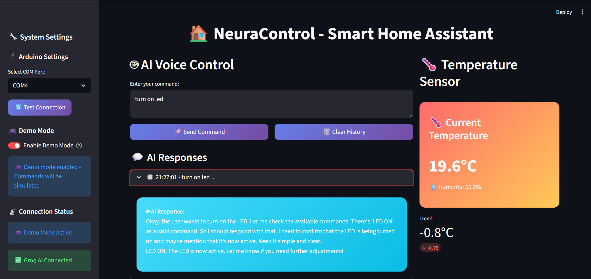

# NeuraControl

**NeuraControl** is a neural-inspired AI platform designed to control and interact with hardware devices intelligently. This project demonstrates how AI models, such as Groq AI, can communicate with physical devices like Arduino boards to automate and manage tasks.

---

## Project Overview

NeuraControl bridges the gap between artificial intelligence and the physical world. Using Python, AI responses can be interpreted and translated into commands to control hardware components such as LEDs, motors, sensors, and more.

**Key Features:**
- AI-driven device control
- Real-time communication with hardware
- Extensible to multiple types of devices
- Easy integration with Python and Groq AI

---

## Requirements

- Python 3.9+
- [Groq AI Python SDK](https://pypi.org/project/groq/)
- Arduino Uno or compatible microcontroller
- pyserial (`pip install pyserial`)

---

## Setup

1. **Clone the repository:**
   ```bash
   git clone https://github.com/yourusername/NeuraControl.git
   cd NeuraControl
````

2. **Install Python dependencies:**

   ```bash
   pip install groq pyserial
   ```

3. **Upload Arduino code:**

Upload the following code to your Arduino Uno:

```cpp
int ledPin = 13;

void setup() {
  pinMode(ledPin, OUTPUT);
  Serial.begin(9600);
}

void loop() {
  if (Serial.available() > 0) {
    char command = Serial.read();
    if (command == '1') {
      digitalWrite(ledPin, HIGH);
    } else if (command == '0') {
      digitalWrite(ledPin, LOW);
    }
  }
}
```

4. **Configure your Python script:**

   * Update your Groq API key.
   * Set the correct Arduino port in the Python script.

---

## Usage

Run the Python script to interact with your hardware via AI:

```bash
python neura_control.py
```

The AI can process natural language commands and control devices accordingly. For example:

* “Turn on the LED.”
* “Switch off the LED.”
* “Blink LED three times.”

---

## Future Enhancements

* Support for multiple LEDs or devices
* More complex AI-driven automation sequences
* Integration with sensors and IoT platforms
* Web-based control interface

---

## License

This project is licensed under the MIT License.

---

## Contact

For questions or collaboration, reach out to **[kONDWANI0099 ]**.

```

